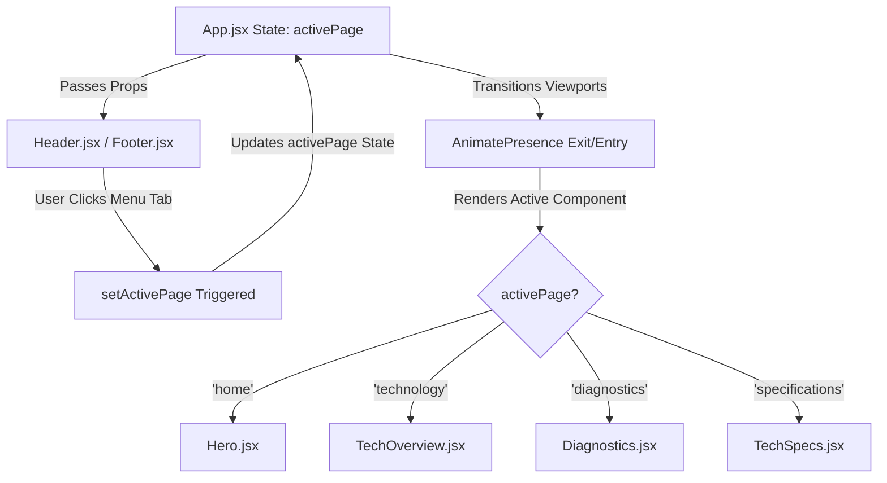
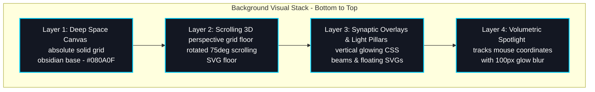
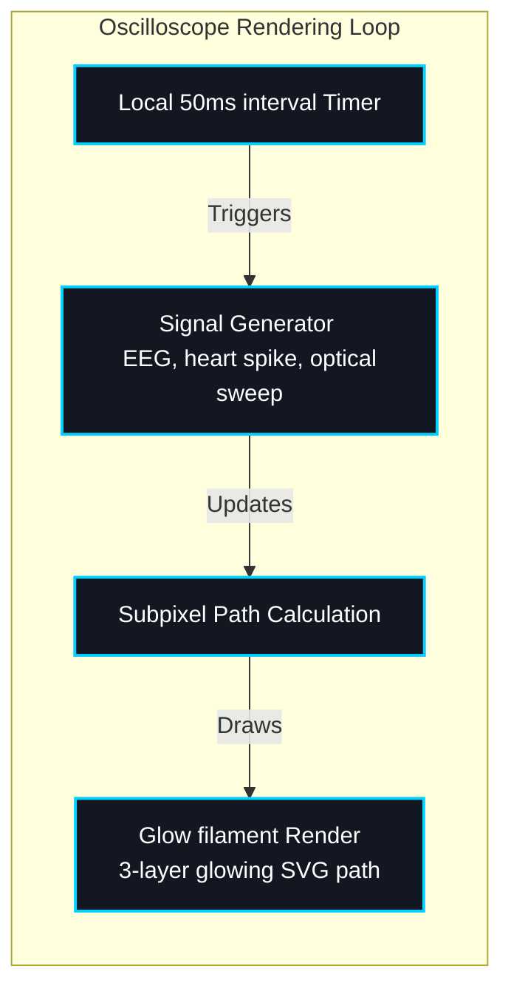

# System Architecture - GraySync

This document outlines the technical layers and rendering systems that drive the GraySync Cyborg landing page.

---

## 1. Page Navigation Lifecycle

GraySync operates as a paginated, single-page application. Instead of stacking every content block vertically, the interface renders only one dedicated page view at a time. The diagram below illustrates the state-based rendering loop:

---

## 2. Volumetric Parallax Elevation

The 3D cyborg layout does not merely stack flat boxes; it floats elements above the digital canvas on dynamic, user-responsive coordinate planes. The table below outlines the specific elevation parameters used:

| Depth Tier | transform: translateZ | z-index Offset | Visual Application | Primary Styling Utility |
| :--- | :--- | :--- | :--- | :--- |
| **Volumetric Spotlight** | `translateZ(35px)` | `z-30` | Specular Glass Glare Spotlight | `background: radial-gradient(...)` |
| **Interactive HUD** | `translateZ(25px)` | `z-20` | Dynamic Titles, Metrics, & Badges | `font-mono`, `text-[#00D2FF]` |
| **Glass Chassis** | `translateZ(0px)` | `z-10` | Frosted Card Frames & Borders | `backdrop-blur-xl`, `bg-[#131722]/75` |
| **Grid Backdrop** | `translateZ(-30px)` | `z-0` | SVG Node Synapses & Light Pillars | `cyborg-subpixel-floor` |

---

## 3. Parallax Backdrop Coordinate Grid

The background relies on a subpixel grid structure to simulate a digital calibration environment:

* **scrolling 3D Floor**: An SVG grid pattern is rotated 75 degrees in 3D space (`perspective: 350px`) using CSS transforms, scrolling infinitely in a low-overhead composite rendering layer.
* **Cursor-Reactive Spotlight**: A large, highly blurred glowing cyan aura tracks client mouse movements in real-time, creating a volumetric light bloom behind the active viewport cards.
* **Synaptic Mesh & Light Beams**: Semi-transparent vector nodes and signal paths are overlaid with rising vertical light columns, breathing at staggered intervals to create ambient depth.

### Stacking Layer Representation

The layer order of the background assets is visualised in the diagram below:

---

## 4. Biometric Telemetry Oscilloscope

The diagnostics monitor operates on a high-speed local rendering loop:

* **Independent Local Timer**: Heartbeat spikes, EEG waves, and optical sweeps run on a localized 50-millisecond clock interval. This keeps high-frequency calculations isolated, avoiding parent re-renders.
* **Subpixel Calibration Grids**: Static coarse and fine SVG coordinate lines are mapped behind the traces to simulate physical glass scope displays.
* **Glow Filaments**: The wave path is plotted as three nested vector lines (a thick glow, a medium filament, and a bright core) to produce high-intensity glowing traces.

### Telemetry Oscilloscope Rendering Loop

The flowchart below traces how simulation ticks update vectors and draw the high-intensity glowing filaments:

