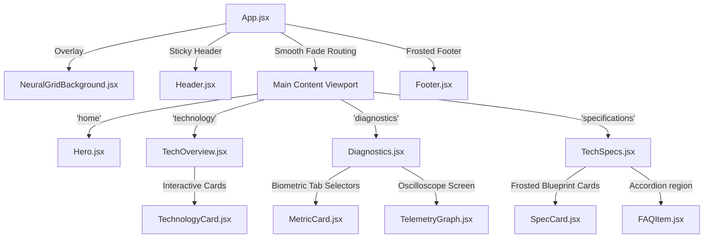

# Developer Documentation - GraySync

This document provides a detailed API and component catalog for the GraySync codebase.

---

## 1. Application Component Hierarchy

The flowchart below displays the file dependencies and visual structure of the GraySync application shell:



---

## 2. Reusable UI Components API

The table below outlines the props and settings accepted by our reusable primitive components:

| Component | Prop Name | Prop Type | Default Value | Prop Description |
| :--- | :--- | :--- | :--- | :--- |
| **Button** | `children` | `React.ReactNode` | *(Required)* | Inside content/label of the button trigger |
| | `variant` | `primary \| secondary \| clinical` | `"primary"` | Controls the button's background and glow style |
| | `onClick` | `() => void` | `undefined` | Callback function executed on click |
| | `disabled` | `boolean` | `false` | Disables hover springs and click callbacks |
| **Badge** | `children` | `React.ReactNode` | *(Required)* | Text label inside the status badge |
| | `variant` | `stable \| warning \| alert \| inactive` | `"stable"` | Controls border backing and dot glow colors |
| **FooterLink** | `onClick` | `() => void` | *(Required)* | Callback function executing page view shifts |
| | `children` | `React.ReactNode` | *(Required)* | Text label of the monospaced directory button |

---

## 3. Page & Layout Sections

These represent major visual sections rendered by the page state manager:

* **Header (`src/components/sections/Header.jsx`)**: Frosted navigation bar containing logo state triggers, stable latency badges, and mobile drawer toggles.
* **Hero Gateway (`src/components/sections/Hero.jsx`)**: Concentric vector tracks rotating around a volumetric pulsing core, displaying the primary digital grid value statements and live metrics.
* **TechOverview (`src/components/sections/TechOverview.jsx`)**: Grid containing technology description cards that support dynamic 3D cursor-tilts and reflections.
* **Diagnostics Console (`src/components/sections/Diagnostics.jsx`)**: Workstation console containing active biometric selectors and real-time oscilloscope monitor layouts.
* **TechSpecs (`src/components/sections/TechSpecs.jsx`)**: Side-by-side splits showcasing blueprint specifications and accordioned operational manual FAQs.
* **Footer (`src/components/sections/Footer.jsx`)**: Frosted glass CTA panel carrying dynamic cyan corner ticks and directory blocks.

### Component Layout Map

The visual interface is structured according to the following layout template:

```text
+-------------------------------------------------------------+
|                     HEADER (sticky bar)                     |
|  [GraySync Logo]      [Home] [Tech] [Diag] [Specs]  [Badge] |
+-------------------------------------------------------------+
|                                                             |
|                    MAIN VIEWPORT CONTAINER                  |
|                                                             |
|   +-----------------------------------------------------+   |
|   |  ACTIVE STATE VIEWPORT                              |   |
|   |  - Hero (home) with pulsing vector rings            |   |
|   |  - TechOverview (grid of 3D hover-tilt cards)       |   |
|   |  - Diagnostics (oscilloscope trace & metrics)       |   |
|   |  - TechSpecs (blueprint list & FAQ accordion)       |   |
|   |                                                     |   |
|   +-----------------------------------------------------+   |
|                                                             |
+-------------------------------------------------------------+
|                     FOOTER (frosted glass)                  |
|  [Corner Tick]                                [Corner Tick] |
|  [Menu Directory]                                [Copyright] |
+-------------------------------------------------------------+
```

---

## 4. Telemetry Integration Hooks

### useTelemetry (`src/hooks/useTelemetry.js`)

A unified react hook generating live simulation coordinates. It runs on a continuous background interval, updating sync rates, core temperatures, and connection latencies.

#### Telemetry Data Structure

| Root Field | Nested Field | Data Type | Sample Value | Operational Description |
| :--- | :--- | :--- | :--- | :--- |
| **brain** | `latency` | `number` | `4.1` | Network sync response time in milliseconds |
| | `syncRate` | `number` | `98.7` | Biological coordinate mesh alignment rate percentage |
| **heart** | `bpm` | `number` | `72` | Real-time biological sensor heart rate readout |
| | `stability` | `number` | `99.4` | Cognitive stability index of the active neural link |
| **core** | `temperature` | `number` | `36.8` | Bio-processor chip chassis heat level in Celsius |
| | `load` | `number` | `14.2` | Operational instruction capacity usage rate percentage |

#### Usage Example

```javascript
const telemetry = useTelemetry();
console.log(telemetry.brain.latency); // Output: 4.1 (dynamic value)
```
