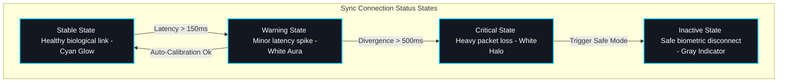

# FAQ & Style Guidelines - GraySync

This document details the aesthetic guidelines for future expansions and answers common operational questions.

---

## 1. Style Theme Tokens

To maintain visual harmony, all layout additions must conform strictly to the four core Cyborg visual tokens. The table below outlines their coordinates and applications:

| Token Name | Hex Code | HSL Coordinate | Glow Tier Application | Layout Role |
| :--- | :--- | :--- | :--- | :--- |
| **Grid Obsidian** | `#080A0F` | `223° 31% 5%` | *No Glow* | Absolute background deep-space canvas |
| **Carbon Charcoal** | `#131722` | `224° 27% 10%` | *No Glow* | Frosted glassmorphic card backgrounds |
| **Cyan Energy** | `#00D2FF` | `191° 100% 50%` | **Level 1 (High)** | Interactive active tracks, nodes, and links |
| **User White** | `#FFFFFF` | `0° 0% 100%` | **Level 2 (Mid)** | Alphanumeric labels and focused alert cores |

---

## 2. Biocompatibility Status Levels

Biomedical sync metrics are tracked using localized glowing node indices, mapped as follow:

| Status Index | Text Color | Indicator Dot | Glow Aura | Description / Operational Meaning |
| :--- | :--- | :--- | :--- | :--- |
| **stable** | `#00D2FF` | Cyan (`#00D2FF`) | Cyan Glow | Connection is healthy and in active biological sync |
| **warning** | White (`#FFFFFF`) | White (`#FFFFFF`) | Cyan Halo | Minor latency gap detected; triggers subpixel calibration |
| **critical** | White (`#FFFFFF`) | White (`#FFFFFF`) | White Halo | Sync divergence detected; triggers safe disconnection |
| **inactive** | Slate (`#64748B`) | Grey (`#475569`) | *No Glow* | Link is safely offline; biological motor pathways neutral |

---

## 3. Developer Visual Guidelines

To preserve the clean visual quality of the cyborg theme, future edits should comply with the following parameters:

* **Color Palette Constraints**: Use only deep backgrounds (`#080A0F` / `#0D0E12`), pure User White (`#FFFFFF`) for text readouts, and high-intensity Cyan Energy Glows (`#00D2FF` / `#00F5D4`) for interactive paths.
* **Subpixel Calibration Details**: Avoid visual clutter. Align components on a clear grid using thin solid borders, perimeter corner ticks (`absolute top-0 left-0 w-2 h-2`), and monospaced telemetry captions.
* **Volumetric Depth**: Keep 3D spring transformations low and responsive (maximum 6-degree rotation tilt) so inputs remain easily clickable.
* **Accessibility Standards**: Ensure keyboard-focus outlines remain visible at all times. Verify that all high-frequency animations freeze instantly under reduced-motion settings.

### Visual HUD Card Anatomy

Future developers must construct cards matching the structural anatomy in the diagram below:

```text
+--[+]---------------------------------------------------------[+]-+
| (0.0, 0.0)                                                      |
|   HUD LABEL: [ SYSTEM BIOMETRICS ]                              |
|   ================================                             |
|                                                                 |
|   +---------------------------------------------------------+   |
|   |                        GRID PANEL                       |   |
|   |  - Core Temp: 36.8°C                     - Load: 14.2%  |   |
|   +---------------------------------------------------------+   |
|                                                                 |
|   [ ACTIVE OVERLAY GLOW: #00D2FF ]                              |
|                                                                 |
| (1.0, 1.0)                                                      |
+--[+]---------------------------------------------------------[+]-+
```

---

## 4. Operations & Safety FAQs

* **Is GraySync safe for long-term neural synchronization?**
  * Yes. GraySync utilizes clinical-grade active biosensor chips combined with micro-thermal dampers to prevent synapto-thermal overload. The interface is continuously regulated by active bio-stability containment protocols.
* **How is user biometric data protected?**
  * All cerebral linkages and telemetry logs are encrypted locally at the hardware level using biometric physical keys. No raw cognitive memories or sync stream parameters are transmitted outside your local terminal.
* **Can the interface overlays be customized?**
  * Yes. The visual overlays and mechanical motor layers support adaptive calibration modes. Users can toggle configurations to focus on rapid sub-second reflex tasks or broad-spectrum sensory mapping overlays.
* **What happens during synchronization connection failures?**
  * In the event of sudden latency gaps or connection disconnections, GraySync automatically triggers safe disconnection protocols. The physical bio-link transitions gracefully to a neutral offline state without interruption.

### Graceful Disconnection Protocol

The flowchart below displays how GraySync handles telemetry connection degradation:


