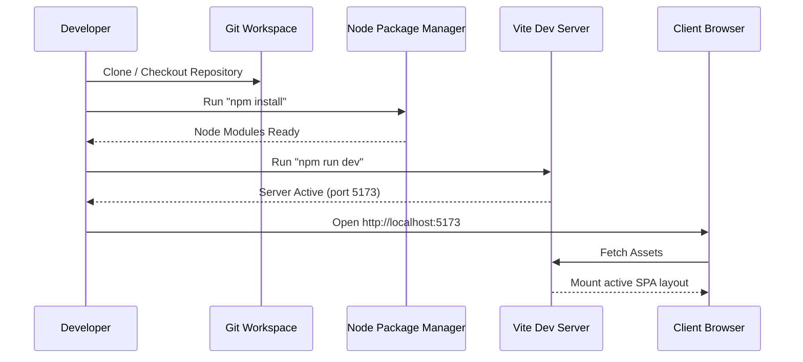
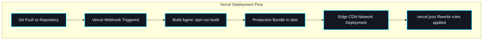

# Operational Procedures - GraySync

This document outlines the step-by-step procedures to run, compile, test, and deploy the GraySync web application.

---

## 1. Developer Workflow Pipeline

The diagram below outlines the standard sequence from local development to production deployment on Vercel:


---

## 2. Command Reference Table

The table below lists the primary scripts and output directories used during development:

| Action Purpose | Terminal Command | Target Directory | Output Artifacts |
| :--- | :--- | :--- | :--- |
| **Active Development** | `npm run dev` | In-Memory (Vite) | Real-time viewport preview |
| **Static Code Check** | `npm run lint` | Root Workspace | Syntactic and formatting results |
| **Production Build** | `npm run build` | `c:\games\SYNC\dist` | Minified HTML, CSS, and JS bundles |
| **Preview Build** | `npm run preview` | Dist Preview | Local server executing bundled assets |

---

## 3. Local Development Launch

To launch the local interactive development server and begin testing component layouts:

1. **Install Dependencies**: Fetch the locked dependency packages from the node registry.

   ```bash
   npm install
   ```

2. **Start Vite Server**: Launch the compiler in active development mode.

   ```bash
   npm run dev
   ```

3. **Access Port**: Open the local address displayed in the terminal (default is `http://localhost:5173`) in the browser.

### Local Launch Sequence

The sequence diagram below visualises the setup flow to get your interactive environment running locally:



---

## 4. Vercel Deployment Setup

Vercel automatically detects the Vite configuration and sets the build commands. To deploy the application cleanly to Vercel's global CDN:

1. **Import Project**: Connect Vercel to the Git repository containing GraySync.
2. **Configure Build Paths**:
   * **Framework Preset**: Vite.
   * **Build Command**: `npm run build` (or `vite build`).
   * **Output Directory**: `dist`.
3. **Deployment Routing**: The root configuration file `vercel.json` rewrite rules will automatically ensure that all incoming sub-requests load `index.html` cleanly, while applying aggressive cache headers to static assets.

### Vercel Edge Build Pipeline

The pipeline below displays the progression of a commit through the automatic compilation and cloud distribution phases:


